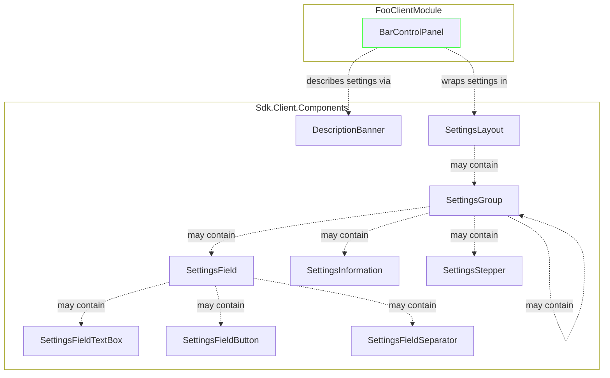

[[_TOC_]]

## Introduction

This document guides through the architecture and implementation of control panels.

It uses the term `FooClientModule` for an exemplary client module.

## Architecture

### Control panel components

```mermaid
flowchart TD
    subgraph "Sdk.Authorization"
        ModuleAuthorizeAttribute
    end

    subgraph SdkClientControlPanels["Sdk.Client.ControlPanels"]
        ControlPanelInfo

        subgraph Extensions
            AddControlPanel("AddControlPanel()")
            AddControlPanelCore("AddControlPanelCore()")

            AddControlPanel-. "calls [1]" .->AddControlPanelCore
            AddControlPanelCore-. "registers" .->IControlPanelRegistry
        end

        subgraph Attributes
           subgraph ControlPanelCategoryAttribute
              ControlPanelCategoryAttributeGenericParameter("CategoryDescriptorType")
           end

           subgraph ControlPanelGroupAttribute
              ControlPanelGroupAttributeGenericParameter("GroupDescriptorType")
           end
        end

        subgraph Services
            IControlPanelDescriptor
            IControlPanelState
            ControlPanelRegistryItem
            ControlPanelRegistry
            IControlPanelRegistry
            IControlPanelCategoryDescriptor
            IControlPanelGroupDescriptor
            IControlPanelSaveHandler
            IControlPanelCancelHandler
            IControlPanelResetHandler
            AuthorizationRequirement
        end

        AddControlPanel-- "returns [2]" -->ControlPanelBuilder

        ControlPanelBuilder-.-WithAutoDiscovery["WithAutoDiscovery()"]
        ControlPanelBuilder-.-WithSaveHandler["WithSaveHandler()"]
        ControlPanelBuilder-.-WithCancelHandler["WithCancelHandler()"]
        ControlPanelBuilder-.-WithResetHandler["WithResetHandler()"]

        WithAutoDiscovery-- "determines" -->ComponentType
        WithAutoDiscovery-- "determines" -->StateType
        WithAutoDiscovery-- "determines" -->DescriptorType
        WithAutoDiscovery-- "determines" -->CategoryDescriptorType
        WithAutoDiscovery-- "determines" -->GroupDescriptorType
        WithAutoDiscovery-- "determines" -->ControlPanelInfoAuthorizeAttribute("ModuleAuthorizeAttribute")

        ComponentType-->ControlPanelInfo
        StateType-->ControlPanelInfo
        DescriptorType-->ControlPanelInfo
        CategoryDescriptorType-->ControlPanelInfo
        GroupDescriptorType-->ControlPanelInfo
        ControlPanelInfoAuthorizeAttribute-->ControlPanelInfo

        WithSaveHandler-- "registers" -->IControlPanelSaveHandler
        WithCancelHandler-- "registers" -->IControlPanelCancelHandler
        WithResetHandler-- "registers" -->IControlPanelResetHandler
        
        ControlPanelInfo-. "provides type to resolve" .->IControlPanelDescriptor
        ControlPanelInfo-. "provides type to resolve" .->IControlPanelState
        ControlPanelInfo-. "provides type to resolve" .->IControlPanelCategoryDescriptor
        ControlPanelInfo-. "provides type to resolve" .->IControlPanelGroupDescriptor
        ControlPanelInfo-. "provides attribute to build" .->AuthorizationRequirement

        IControlPanelDescriptor-- "passed to" -->ControlPanelRegistryItem
        IControlPanelState-- "passed to" -->ControlPanelRegistryItem
        IControlPanelCategoryDescriptor-- "passed to" -->ControlPanelRegistryItem
        IControlPanelGroupDescriptor-- "passed to" -->ControlPanelRegistryItem

        ControlPanelRegistryItem-- "passed to" -->ControlPanelRegistry
        ControlPanelRegistry-- "implements" -->IControlPanelRegistry
    end

    subgraph FooClientModule
        BarControlPanel
        FooClientModuleServices["Services"]

        ConfigureServices("ConfigureServices()")
    end

    ConfigureServices-- "calls" -->AddControlPanel

    BarControlPanel-. "decorated with" .->ControlPanelCategoryAttribute
    BarControlPanel-. "decorated with" .->ControlPanelGroupAttribute
    BarControlPanel-. "decorated with" .->ModuleAuthorizeAttribute

    AuthorizationRequirement-- "passed to" -->ControlPanelRegistryItem

    classDef cluster fill:#ffffff10
    classDef authorization stroke:#ffff00
    classDef component stroke:#00ff00
    classDef controlPanelServices stroke:#ff00ff

    class ModuleAuthorizeAttribute,AuthorizationRequirement,ControlPanelInfoAuthorizeAttribute authorization;
    class BarControlPanel,ComponentType component;
    class FooClientModuleServices,StateType,DescriptorType,CategoryDescriptorType,GroupDescriptorType,IControlPanelDescriptor,IControlPanelState,IControlPanelCategoryDescriptor,IControlPanelGroupDescriptor,IControlPanelSaveHandler,IControlPanelCancelHandler,IControlPanelResetHandler,ControlPanelCategoryAttributeGenericParameter,ControlPanelGroupAttributeGenericParameter controlPanelServices;
```



### Settings components



## Implementation

### 1. Preamble

For the following  file structure in `FooClientModule` is assumed:

```
+ Foo.Client
  + Foo.Client.csproj
  + FooClientModule.cs
```
### 2. Add control panel state

- Add `BarControlPanelState.cs`

  ``` csharp
  using Sdk.Client.ControlPanels.Services;

  namespace Foo.Client;

  public sealed class BarControlPanelState : ControlPanelState
  {
  }
  ```
  > If you don't want to implement specific state then simply use [`ControlPanelState`](../src/Sdk.Client/ControlPanels/Services/ControlPanelState.cs) in the following steps instead of `BarControlPanelState`.

### 3. Add control panel

- Add `BarControlPanel.razor`

  ``` html
  @using Sdk.Client.ControlPanels.Components
  @using Sdk.Client.ControlPanels.Services

  @inherits ControlPanelBase<BarControlPanelState>
  
  @* content of control panel comes here *@
  ```

- Add code-behind file `BarControlPanel.razor.cs`

  ``` csharp
  namespace Foo.Client;

  public sealed partial class BarControlPanel : ControlPanelBase<BarControlPanelState>
  {
      // logic of the control panel comes here
  }
  ``` 
### 4.1 Add control panel content

> It is recommended to use component [`SettingsLayout`](../src/Sdk.Client.Components/Settings/SettingsLayout.razor.cs), [`SettingsGroup`](../src/Sdk.Client.Components/Settings/SettingsGroup.razor.cs), [`SettingsField`](../src/Sdk.Client.Components/Settings/SettingsField.razor.cs), [`SettingsFieldTextBox`](../src/Sdk.Client.Components/Settings/SettingsFieldTextBox.razor.cs), [`SettingsFieldButton`](../src/Sdk.Client.Components/Settings/SettingsFieldButton.razor.cs), [`SettingsFieldSeparator`](../src/Sdk.Client.Components/Settings/SettingsFieldSeparator.razor.cs), [`SettingsStepper`](../src/Sdk.Client.Components/Settings/SettingsStepper.razor.cs) and [`SettingsInformation`](../src/Sdk.Client.Components/Settings/SettingsInformation.razor.cs) to implement content in a unified way holding on to a unified user experience. See [architecture diagram](#settings-components) to understand how it all fits together.

- Add layout

  ``` html
  <SettingsLayout></SettingsLayout>
  ```

- Add settings group

  ``` html
  <SettingsLayout>
      <SettingsGroup Title="Connection" Subline="Connection settings" @bind-Expanded="State.ConnectionExpanded">
      </SettingsGroup>
  </SettingsLayout>
  ```

  > `Subline` and `Expanded` are optional parameters. In the preceding example `ConnectionExpanded` is a property of inherited parameter `State`. The property is [bound](https://learn.microsoft.com/en-us/aspnet/core/blazor/components/data-binding) to `Expanded` to provide the expanded state to the `SettingsGroup` component and receive the new state when the expander is clicked. This ensures that the expanded state is preserved across render cycles.

  > You may nest `SettingsGroup` in `SettingsGroup`. Deeper nesting is not supported.

  > `SettingsGroup` supports customizing the expander via property `Expander`. It is recommended to use [`ComboBoxExpander`](../src/Sdk.Client.Components/Settings/Expanders/ComboBoxExpander.razor.cs) or [`SwitchExpander`](../src/Sdk.Client.Components/Settings/Expanders/SwitchExpander.razor.cs).

- Add settings field

  ``` html
  <SettingsLayout>
      <SettingsGroup Title="Connection" Subline="Connection settings" @bind-Expanded="State.ConnectionExpanded">
          <SettingsField Label="Name">
              <SettingsFieldTextBox Placeholder="Name" @bind-Value="@State.ConnectionName" />
          </SettingsField>

          <SettingsField>
              SettingsFieldButton Text="Test connection" OnClick="TestConnectionButtonClick" />
          </SettingsField>
      </SettingsGroup>
  </SettingsLayout>
  ```

  > In the preceding example `ConnectionName` is a property of inherited parameter `State`. The property is [bound](https://learn.microsoft.com/en-us/aspnet/core/blazor/components/data-binding) to the input element to provide / receive the setting value and to preserve it across render cycles.

  > You can also use [`SettingsInformation`](../src/Sdk.Client.Components/Settings/SettingsInformation.razor.cs) instead of [`SettingsField`](../src/Sdk.Client.Components/Settings/SettingsField.razor.cs) to render a block of informational content.

  > You can use [`SettingsFieldSeparator`](../src/Sdk.Client.Components/Settings/SettingsFieldSeparator.razor.cs) between a set of [`SettingsField`](../src/Sdk.Client.Components/Settings/SettingsField.razor.cs) or other components to have a visual separation between the sets.

  > You can use [`SettingsStepper`](../src/Sdk.Client.Components/Settings/SettingsStepper.razor.cs) below a [`SettingsField`](../src/Sdk.Client.Components/Settings/SettingsField.razor.cs) to render a component with plus / minus buttons.

- Optional, wrap content in [`ControlPanelPage`](../src/Sdk.Client/ControlPanels/Components/ControlPanelPage.razor.cs)

  ``` html
  <ControlPanelPage Title="General">
      @* content of control panel page comes here *@
  </ControlPanelPage>
  ```

  > Wrapping content in [`ControlPanelPage`](../src/Sdk.Client/Components/ControlPanelPage.razor.cs) results in a tab being displayed for the content in the header area of the settings popup.

- Optional, add [`DescriptionBanner`](../src/Sdk.Client.Components/Settings/DescriptionBanner.razor.cs) to show a brief description for the control panel or control panel page

  ``` html
  <ControlPanelPage Title="General">
    <DescriptionBanner Title="Lorem ipsum">
        Dolor sit amet
    </DescriptionBanner>

    @* content of control panel page comes here *@
  </ControlPanelPage>
  ```

### 5. Add control panel descriptor

- Add `BarControlPanelDescriptor.cs`

  ``` csharp
  using Sdk.Client.ControlPanels.Services;
  using Sdk.Client.Modules;

  namespace Foo.Client;

  public sealed class BarControlPanelDescriptor : IControlPanelDescriptor<BarControlPanel>
  {
      public string Title => "General";
      public Uri IconUrl => ModuleAssetHelper.GetModuleIconUrl<FooClientModule>("icon.svg");
  }
  ```

### 6. Add control panel category descriptor

- Add `BarControlPanelCategoryDescriptor.cs`

  ``` csharp
  using Sdk.Client.ControlPanels.Services;
  using Sdk.Client.Modules;

  namespace Foo.Client;

  public sealed class BarControlPanelCategoryDescriptor : IControlPanelCategoryDescriptor
  {
      public string Title => "Foo";
      public string? IconCssClass => null;
      public Uri? IconUrl => ModuleAssetHelper.GetModuleIconUrl<FooClientModule>("icon.svg");
      public int? Position => 3;
  }
  ```

### 7. Add control panel group descriptor (optional)

- Add `BarControlPanelGroupDescriptor.cs`

  ``` csharp
  using Sdk.Client.ControlPanels.Services;
  using Sdk.Client.Modules;

  namespace Foo.Client;

  public sealed class BarControlPanelGroupDescriptor : IControlPanelGroupDescriptor
  {
      public int Position => 3;
  }
  ```

### 8. Make control panel known

You can either [enable auto-discovery](#91-enable-auto-discovery) or manually register the control panel in a registry by [configuring visibility at runtime](#92-configure-visibility-at-runtime).

### 9. Configure control panel (optional)

#### 9.1 Enable auto-discovery

- Define a control panel category with [`ControlPanelCategoryAttribute`](../src/Sdk.Client/ControlPanels/Attributes/ControlPanelCategoryAttribute.cs)

  ``` csharp
  using Sdk.Client.ControlPanels.Attributes;

  namespace Foo.Client;

  ...
  [ControlPanelCategory<BarControlPanelCategoryDescriptor>]
  public sealed partial class BarControlPanel ...
  {
      ...
  }
  ```

- Optionally define a control panel group with [`ControlPanelGroupAttribute`](../src/Sdk.Client/ControlPanels/Attributes/ControlPanelGroupAttribute.cs)

  ``` csharp
  using Sdk.Client.ControlPanels.Attributes;

  namespace Foo.Client;

  ...
  [ControlPanelGroup<BarControlPanelGroupDescriptor>]
  public sealed partial class BarControlPanel ...
  {
      ...
  }
  ```

- Add control panel

  ``` csharp
  using Sdk.Client.ControlPanels.Extensions;

  public sealed class FooClientModule : ClientModule
  {
      ...

      public override Action<IServiceCollection, HostingModel> ConfigureServices => (services, _) =>
      {
          services.AddControlPanel<FooClientModule, BarControlPanel, BarControlPanelState>()
              .WithAutoDiscovery<BarControlPanelDescriptor>();
      };
  }
  ```

  The extension method [`AddControlPanel<TClientModule, TControlPanel, TState>()`](../src/Sdk.Client/ControlPanels/Extensions/IServiceCollectionExtensions.cs#L27) registers the following core services:

  | Service type                                                                                                | Implementation type                                                                                       | Description                                        |
  |-------------------------------------------------------------------------------------------------------------|-----------------------------------------------------------------------------------------------------------|----------------------------------------------------|
  | [`IControlPanelRegistry<TClientModule>`](../src/Sdk.Client/ControlPanels/Services/IControlPanelRegistry.cs) | [`ControlPanelRegistry<TClientModule>`](../src/Sdk.Client/ControlPanels/Services/ControlPanelRegistry.cs) | Registry for all control panels of `TClientModule` |
  | [`IControlPanelPageRegistry`](../src/Sdk.Client/ControlPanels/Services/IControlPanelPageRegistry.cs)        | [`ControlPanelPageRegistry`](../src/Sdk.Client/ControlPanels/Services/ControlPanelPageRegistry.cs)        | Registry for control panel pages, for internal use |

  The builder method [`WithAutoDiscovery<TDescriptor>()`](../src/Sdk.Client/ControlPanels/ControlPanelBuilder.cs#L19) registers the following scoped services:

  | Service type                                                                                                    | Implementation type         | Description                                                                                                                                                                            | Registered as [keyed service](../src/Sdk.Client/ControlPanels/ControlPanelServiceKey.cs) |
  |-----------------------------------------------------------------------------------------------------------------|-----------------------------|----------------------------------------------------------------------------------------------------------------------------------------------------------------------------------------|------------------------------------------------------------------------------------------|
  | [`IControlPanelDescriptor<TControlPanel>`](../src/Sdk.Client/ControlPanels/Services/IControlPanelDescriptor.cs) | `TDescriptor`               | Descriptor for the control panel                                                                                                                                                       | No                                                                                       |
  | [`IControlPanelState`](../src/Sdk.Client/ControlPanels/Services/IControlPanelState.cs) `TState`                 | State for the control panel | Yes                                                                                                                                                                                    |                                                                                          |
  | `TCategoryDescriptor`                                                                                           | `TCategoryDescriptor`       | Category for the control panel, `TCategoryDescriptor` is retrieved from [`ControlPanelCategoryAttribute`](../src/Sdk.Client/ControlPanels/Attributes/ControlPanelCategoryAttribute.cs) | No                                                                                       |
  | `TGroupDescriptor`                                                                                              | `TGroupDescriptor`          | Group for the control panel, `TGroupDescriptor` is retrieved from [`ControlPanelGroupAttribute`](../src/Sdk.Client/ControlPanels/Attributes/ControlPanelGroupAttribute.cs)             | No                                                                                       |

  > The control panel will be visible by default as it will be added to [`IControlPanelRegistry<TClientModule>`](../src/Sdk.Client/ControlPanels/Services/IControlPanelRegistry.cs) on resolve of the registry service type. See [architecture diagram](#control-panel-components) to understand how it all fits together.

  > As an alternative, control panels are allowed to be registered manually in the registry to [configure visibility at runtime](#92-configure-visibility-at-runtime).

#### 9.2 Configure visibility at runtime

- When [auto-discovery](#91-enable-auto-discovery) is **not** used, register core services

  ``` csharp
  using Sdk.Client.ControlPanels.Extensions;

  public sealed class FooClientModule : ClientModule
  {
      ...

      public override Action<IServiceCollection, HostingModel> ConfigureServices => (services, _) =>
      {
          services.AddControlPanelCore<FooClientModule>();
      };
  }
  ```

- Show control panel

  ``` csharp
  IControlPanelRegistry<FooClientModule> controlPanelRegistry = ...;

  controlPanelRegistry.Add<BarControlPanel, BarControlPanelState>(
      new BarControlPanelDescriptor(),
      new BarControlPanelState(),
      new BarControlPanelCategoryDescriptor(),
      new BarControlPanelGroupDescriptor());
  ```

- Hide control panel

  ``` csharp
  IControlPanelRegistry<FooClientModule> controlPanelRegistry = ...;

  controlPanelRegistry.Remove<BarControlPanel>();
  ```

> Additionally, the visibility can be controlled with features like authorization, see next section.

#### 9.3 Configure authorization

> Authorization affects the visibility of control panels at runtime. A control panel will not be visible when authorization fails.

- Provide authorization details

  ``` csharp
  ...
  [ModuleAuthorize<FooClientModule>(AccessLevel.Admin)]
  public sealed partial class BarControlPanel
  {
      ...
  }
  ```

  ``` csharp
  IControlPanelRegistry<FooClientModule> controlPanelRegistry = ...;

  var moduleId = ModuleIdResolver.ResolveId<FooClientModule>();
  var authorizationRequirement = new AccessLevelRequirement(moduleId, AccessLevel.Admin);

  controlPanelRegistry.Add<BarControlPanel, BarControlPanelState>(
      new BarControlPanelDescriptor(),
      new BarControlPanelState(),
      new BarControlPanelCategoryDescriptor(),
      new BarControlPanelGroupDescriptor(),
      authorizationRequirement);
  ```

#### 9.4 Configure save handler and optional cancel / reset handler

- Configure handlers with a call to the associated `With` method provided by [`IControlPanelBuilder<TClientModule, TControlPanel, TState>`](../src/Sdk.Client/ControlPanels/IControlPanelBuilder.cs).

  ``` csharp
  using Sdk.Client.ControlPanels.Extensions;

  public sealed class FooClientModule : ClientModule
  {
      ...

      public override Action<IServiceCollection, HostingModel> ConfigureServices => (services, _) =>
      {
          var controlPanelBuilder = services.AddControlPanel<FooClientModule, BarControlPanel, BarControlPanelState>();

          controlPanelBuilder.WithSaveHandler<BarControlPanelSaveHandler>();
      };
  }
  ```

## FAQ

### How to show a loading indication while executing tasks?

The loading indication can be controlled via [`IControlPanelState`](../src/Sdk.Client/ControlPanels/Services/IControlPanelState.cs).
An instance is passed to the control panel via Parameter `State`, which means that the required methods are directly available in the control panel.

``` csharp
namespace Foo.Client;

public sealed partial class BarControlPanel : ControlPanelBase<BarControlPanelState>
{
    private async Task OnExecuteOperation()
    {
        State.BeginLoading()
        try
        {
            // execute operation
        }
        finally
        {
            State.EndLoading();
        }
    }
}
```
