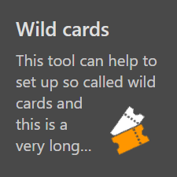

[[_TOC_]]

# Introduction

This document guides through the implementation of navigation tiles exemplarily based on client module `FooClientModule`.

The following file structure is assumed in this guide:

```
+ Foo.Client
  + Foo.Client.csproj
  + FooClientModule.cs
```

## Steps

### 1. Enable navigation tile services

- Call extension method [`AddNavTiles<TClientModule>()`](../src/Sdk.Client/NavTiles/Extensions/IServiceCollectionExtensions.cs#L12)

  ``` csharp
  // Foo.Client/FooClientModule.cs
  
  using Sdk.Client.NavTiles.Extensions;

  public sealed class FooClientModule : ClientModule
  {
      ...

      public override Action<IServiceCollection, HostingModel> ConfigureServices => (services, _) =>
      {
          services.AddNavTiles<FooClientModule>();
      };
  }
  ```

  As a result, the following services are registered in the DI container:

  Service | Description 
  -|-
  [`INavTileRegistry<TClientModule>`](../src/Sdk.Client/NavTiles/Services/INavTileRegistry.cs) | Scoped service to get, add or remove navigation tiles visible at runtime
  [`INavTileRegistry<IClientModule>`](../src/Sdk.Client/NavTiles/Services/INavTileRegistry.cs) | For resolving all registries into an `IEnumerable<>`

### 2. Add navigation tile

- Add `FooNavTile.razor`

  ``` razor
  @inherits NavTileBase
  
  @* content of navigation tile comes here *@
  ```

- Add code-behind file `FooNavTile.razor.cs`

  ``` csharp
  using Sdk.Client.NavTiles.Components;

  public partial class FooNavTile : NavTileBase
  {
      // logic of the navigation tile comes here
  }
  ``` 

### 3. Configure navigation tile (optional)

#### 3.1 Enable automatic discovery

- Decorate the navigation tile class with [`InitialNavTileAttribute`](../src/Sdk.Client/NavTiles/Attributes/InitialNavTileAttribute.cs)

  ``` csharp
  using Sdk.Client.NavTiles.Attributes;
  ...

  [InitialNavTile<FooClientModule>]
  public partial class FooNavTile ...
  {
      ...
  }
  ```

  > The attribute ensures that the navigation tile is automatically discovered on instantiation of [`INavTileRegistry<TClientModule>`](../src/Sdk.Client/NavTiles/Services/INavTileRegistry.cs). As a result, the navigation tile is visible by default. If the class is not decorated with the attribute then it must be registered manually in the registry, see section [Configure visibility at runtime](#34-configure-visibility-at-runtime).

#### 3.2 Configure initial appearance

- Adjust the parameters of [`InitialNavTileAttribute`](../src/Sdk.Client/NavTiles/Attributes/InitialNavTileAttribute.cs)

#### 3.3 Configure state at runtime

- Alter the navigation tile state, either by retrieving the state from `INavTileRegistry<FooClientModule>` ...

    ``` csharp
    string navTileId = ...;

    INavTileRegistry<FooClientModule> navTileRegistry = ...;

    if (navTileRegistry.TryGet(navTileId, out var navTileRegistryItem))
    {
      navTileRegistryItem.State.Enabled = false;
    }
    ```

  ... or using [`NavTileBase.State`](../src/Sdk.Client/NavTiles/Components/NavTileBase.cs#L7)

    ``` csharp
    public partial class FooNavTile : NavTileBase
    {
        private void OnSomethingHappend()
        {
            State.Enabled = false;
        }
    }
    ```

#### 3.4 Configure visibility at runtime

> Each navigation tile that should be visible at runtime must be registered in `INavTileRegistry<FooClientModule>`. Additionally, the visibility can be controlled with features like [authorization](#35-configure-authorization).

- Show navigation tile

  ``` csharp
  INavTileRegistry<FooClientModule> navTileRegistry = ...;
  string navTileId = ...;

  navTileRegistry.Add<FooNavTile>(navTileId);
  ```

- Hide navigation tile

  ``` csharp
  INavTileRegistry<FooClientModule> navTileRegistry = ...;
  string navTileId = ...;

  navTileRegistry.Remove(navTileId);
  ```

#### 3.5 Configure click handling

- Provide link target for default click handling (navigation to a specific location)

  ``` csharp
  [InitialNavTile<FooClientModule>(LinkTarget = "/foo")]
  public partial class FooNavTile ...
  {
      ...
  }
  ```

  ``` csharp
  INavTileRegistry<FooClientModule> navTileRegistry = ...;

  navTileRegistry.Add<FooNavTile>(..., linkTarget: "/foo");
  ```

- Implement own click handling

  ``` csharp
  public partial class FooNavTile ...
  {
      public override void Click()
      {
        State.BeginLoading(); // show a loading indication in the navigation tile
        
        // do additional stuff something
      }
  }
  ```

#### 3.5 Configure authorization

> Authorization affects the visibility of navigation tiles at runtime. A navigation tile will not be visible when authorization fails.

- Provide authorization details

  ``` csharp
  ...
  [ModuleAuthorize<FooClientModule>(AccessLevel.Admin)]
  public partial class FooNavTile ...
  {
      ...
  }
  ```

  ``` csharp
  INavTileRegistry<FooClientModule> navTileRegistry = ...;

  var moduleId = ModuleIdResolver.ResolveId<FooClientModule>();
  var authorizationRequirement = new AccessLevelAuthorizationRequirement(moduleId, AccessLevel.Admin);

  navTileRegistry.Add<FooNavTile>(..., authorizationRequirement);
  ```

### 4. Add navigation tile content

#### 4.1 Standard content

The suite ships with a component named [`NavTileStandardContent`](../src/Sdk.Client/NavTiles/Components/NavTileStandardContent.razor.cs) to implement standard content in a unified way. It implements a headline, subline and an icon in the lower right corner.

Example

- `FooNavTile.razor`

  ``` razor
  @using Sdk.Client.NavTiles.Components

  @inherits NavTileBase

  <NavTileStandardContent Headline="Wild cards"
                          Subline="This tool can help to set up so called wild cards and this is a very long subline showing an ellipsis on overflow"
                          IconSrc="@(ModuleAssetHelper.GetModuleIconUrl<FooClientModule>("wild-cards.svg"))"
                          IconAlt="Wild cards icon"
                          OnContentLoading="@ContentLoading"
                          OnContentReady="@ContentReady" />
  ```

- Output

  

#### 4.2 Special content

The suite ships with a component named [`NavTileSpecialContent`](../src/Sdk.Client/NavTiles/Components/NavTileSpecialContent.razor.cs) to implement special content in a unified way. It implements a headline, subline and left / right content area.

> This component should only be used in connection with navigation tiles configured with [`HorizontalSpan.Two`](../src/Sdk.Client/NavTiles/Enums/NavTileSpan.cs). 

Example

- `FooNavTile.razor.cs`

  ``` csharp
  using Sdk.Client.NavTiles.Attributes;
  using Sdk.Client.NavTiles.Components;
  using Sdk.Client.NavTiles.Enums;

  [InitialNavTile<FooClientModule>(HorizontalSpan = NavTileSpan.Two)]
  public partial class FooNavTile ...
  {
      ...
  }
  ```

- `FooNavTile.razor`

  ``` csharp
  @using Sdk.Client.Components.Colors
  @using Sdk.Client.Components.IconAndValue
  @using Sdk.Client.Components.MiniChart
  @using Sdk.Client.NavTiles.Components

  @inherits NavTileBase

  <NavTileSpecialContent Headline="Sales income"
                        Subline="Cash income overview shows your money when paid by customers"
                        LeftContentDescription="in 1000k"
                        RightContentDescription="Figures Q1">
      <LeftContent>
          <IconAndValueComponent IconSrc="@(ModuleAssetHelper.GetModuleIconUrl<PingModule>("ticket.svg"))"
                                IconAlt="Sales income icon"
                                Value="19.84"
                                MeasurementUnit="€" />
      </LeftContent>
      <RightContent>
          <MiniChartComponent Orientation="MiniChartOrientation.Vertical">
              <MiniChartValueComponent Minimum="0" Maximum="100" Current="35" Label="A1" FillColor="StandardHtmlColor.From(StandardColor.Blue)" />
              <MiniChartValueComponent Minimum="0" Maximum="100" Current="80" Label="B2" FillColor="StandardHtmlColor.From(StandardColor.Orange)" />
              <MiniChartValueComponent Minimum="0" Maximum="100" Current="55" Label="C2" FillColor="StandardHtmlColor.From(StandardColor.LightGreen)" />
              <MiniChartValueComponent Minimum="0" Maximum="100" Current="95" Label="D4" FillColor="StandardHtmlColor.From(StandardColor.Red)" />
          </MiniChartComponent>
      </RightContent>
  </NavTileSpecialContent>
  ```

  > The example code above uses component [`IconAndValueComponent`](../src/Sdk.Client.Components/IconAndValue/IconAndValueComponent.razor.cs) and [`MiniChartComponent`](../src/Sdk.Client.Components/MiniChart/MiniChartComponent.razor.cs) to implement the left and right content in a unified way.

- Output

  
