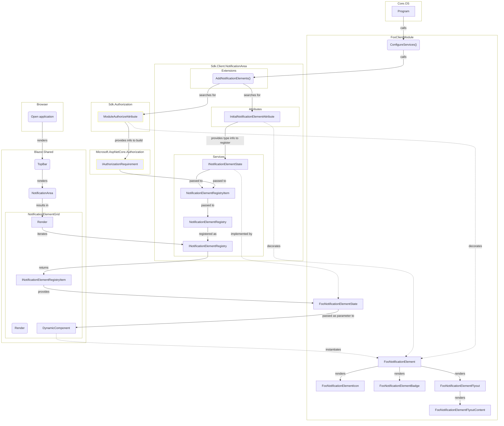

[[_TOC_]]

## Introduction

This document guides through the architecture and implementation of notification elements displayed in the notification area of the top bar.

It uses the term `FooClientModule` for an exemplary client module.

## Architecture



## Implementation

### 1. Preamble

For the following  file structure in `FooClientModule` is assumed:

```
+ Foo.Client
  + Foo.Client.csproj
  + FooClientModule.cs
```

### 2. Enable notification element services

- Call extension method [`AddNotificationElements<TClientModule>()`](../src/Sdk.Client/NotificationArea/Extensions/IServiceCollectionExtensions.cs#L25)

  ``` csharp
  // Foo.Client/FooClientModule.cs

  using Sdk.Client.NotificationArea.Extensions;

  public sealed class FooClientModule : ClientModule
  {
      ...

      public override Action<IServiceCollection, HostingModel> ConfigureServices => (services, _) =>
      {
          services.AddNotificationElements<FooClientModule>();
      };
  }
  ```

  As a result, the following services are registered based on the given client module type per notification element decorated with [`InitialNotificationElementAttribute`](../src/Sdk.Client/NotificationArea/Attributes/InitialNotificationElementAttribute.cs) in the DI container:

  Service | Description
  -|-
  Class implementing [`INotificationElementState`](../src/Sdk.Client/NotificationArea/Services/INotificationElementState.cs) | The state for a notification element. The class is retrieved from parameter `TState` of base class [`NotificationElementBase<>`](../src/Sdk.Client/NotificationArea/Components/NotificationElementBase.cs) picked from the inheritance chain of the notification element. Once found it is registered as [keyed service](../src/Sdk.Client/NotificationArea/NotificationElementServiceKey.cs).

  Additionally, the following services are registered based on the given client module type in the DI container:

  Service | Description
  -|-
  [`INotificationElementRegistry<TClientModule>`](../src/Sdk.Client/NotificationArea/Services/INotificationElementRegistry.cs) | Registry for all notification elements of a client module

### 3. Add notification element state

- Add `FooNotificationElementState.cs`

  ``` csharp
  using Sdk.Client.NotificationArea.Services;

  namespace Foo.Client;

  public sealed class FooNotificationElementState : NotificationElementState
  {
  }
  ```
  > If you don't want to implement specific state then simply use [`NotificationElementState`](../src/Sdk.Client/NotificationArea/Services/NotificationElementState.cs) in the following steps instead of `FooNotificationElementState`.

### 4. Add notification element icon

- Add `FooNotificationElementIcon.razor`

  ``` razor
  @using Sdk.Client.Enums
  @using Sdk.Client.NotificationArea.Components
  @using ViciOne.Ui.MonochromeIcons.Components
  @using ViciOne.Ui.MonochromeIcons.Core.Enums

  @implements INotificationElementIcon

  <MonochromeIcon Name="@MonochromeIconName.Wifi" Size="@MonochromeIconSize.Small" />
  ```

  > The code above uses the [MonochromeIcon](https://gitlab.com/vicione-oss/vicione/ui-libs/monochrome-icons/-/blob/main/src/ViciOne.Ui.MonochromeIcons.Components/MonochromeIcon.razor.cs) component from the [Monochrome Icons repository](https://gitlab.com/vicione-oss/vicione/ui-libs/monochrome-icons/-/blob/main/README.md?ref_type=heads) to implement the icon.

### 5. Add notification element badge (optional)

- Add `FooNotificationElementBadge.cs`

  ``` csharp
  using Sdk.Client.NotificationArea.Components;

  namespace Foo.Client;

  internal sealed class FooNotificationElementBadge : NotificationElementNumberBadgeBase
  {
      protected override int? GetNumber() => ...
  }
  ```

### 6. Add notification element flyout (optional)

- Add `FooNotificationElementFlyoutContent.razor`

  ``` razor
  @using Sdk.Client.NotificationArea.Components

  @inherits ComponentBase
  @implements INotificationElementFlyoutContent

  Lorem ipsum
  ```

- Add `FooNotificationElementFlyout.cs`

  ``` csharp
  using Sdk.Client.NotificationArea.Components;

  namespace Foo.Client;

  internal class FooNotificationElementFlyout : NotificationElementFlyout<FooNotificationElementState, FooNotificationElementFlyoutContent>
  {
      protected override string? GetHeading() => ...
  }
  ```

### 7. Add notification element

- Add `FooNotificationElement.cs`

  ``` csharp
  using Sdk.Client.NotificationArea.Components;

  namespace Foo.Client;

  internal sealed class FooNotificationElement : NotificationElement<FooNotificationElementState, FooNotificationElementIcon>
  {
      public CounterNotificationElement()
      {
          RegisterBadge<FooNotificationElementBadge>();
          RegisterFlyout<FooNotificationElementFlyout>();
      }

      protected override string GetTitle() => ...
  }
  ```

### 8. Configure notification element (optional)

#### 8.1 Enable automatic discovery

- Decorate the notification element with [`InitialNotificationElementAttribute`](../src/Sdk.Client/NotificationArea/Attributes/InitialNotificationElementAttribute.cs)

  ``` csharp
  using Sdk.Client.NotificationArea.Attributes;

  namespace Foo.Client;

  [InitialNotificationElement<FooClientModule>]
  internal sealed class FooNotificationElement : NotificationElement<FooNotificationElementState, FooNotificationElementIcon>
  {
      ...
  }
  ```

  > The attribute ensures that the notification element is automatically discovered when [`AddNotificationElements<TClientModule>()`](../src/Sdk.Client/NotificationArea/Extensions/IServiceCollectionExtensions.cs#L25) is called. As a result, the notification element is visible by default. If the class is not decorated with the attribute then it must be registered manually in the registry, see the following section [Configure visibility at runtime](#82-configure-visibility-at-runtime).

#### 8.2 Configure visibility at runtime

> Each notification element that should be rendered must be registered in [`INotificationElementRegistry<FooClientModule>`](../src/Sdk.Client/NotificationArea/Services/INotificationElementRegistry.cs). The actual visibility then depends on flag [`INotificationElementState.Visible`](../src/Sdk.Client/NotificationArea/Services/INotificationElementState.cs#L24). Additionally, the visibility can be controlled with features like [authorization](#83-configure-authorization).

- Show notification element

  ``` csharp
  INotificationElementRegistry<FooClientModule> notificationElementRegistry = ...;

  notificationElementRegistry.Add<FooNotificationElement, FooNotificationElementState>(
      new FooNotificationElementState());
  ```

- Hide notification element

  ``` csharp
  INotificationElementRegistry<FooClientModule> notificationElementRegistry = ...;

  notificationElementRegistry.Remove<FooNotificationElement>();
  ```

#### 8.3 Configure authorization

> Authorization affects the visibility of notification elements at runtime. A notification element will not be visible when authorization fails.

- Provide authorization details

  ``` csharp
  ...
  [ModuleAuthorize<FooClientModule>(AccessLevel.Admin)]
  internal sealed class FooNotificationElement ...
  {
      ...
  }
  ```

  ``` csharp
  IINotificationElementRegistry<FooClientModule> notificationElementRegistry = ...;

  var moduleId = ModuleIdResolver.ResolveId<FooClientModule>();
  var authorizationRequirement = new AccessLevelAuthorizationRequirement(moduleId, AccessLevel.Admin);

  notificationElementRegistry.Add<FooNotificationElement, FooNotificationElementState>(..., authorizationRequirement);
  ```
