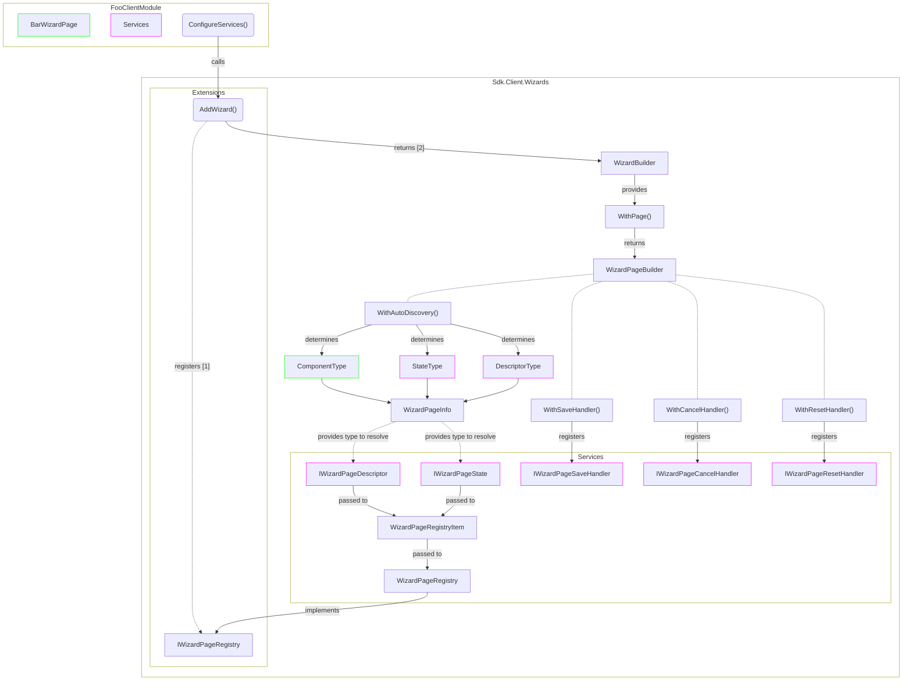
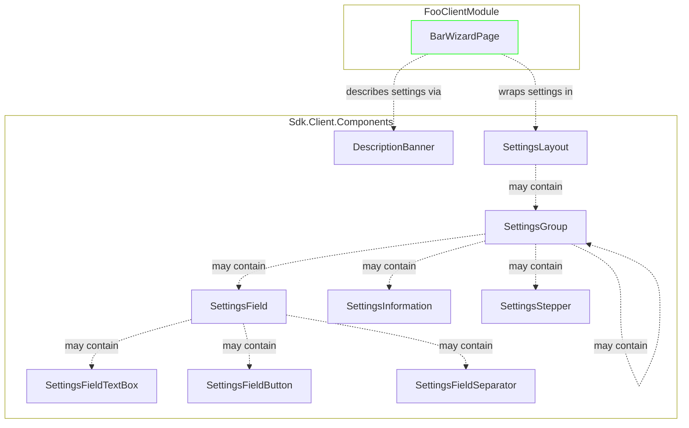

[[_TOC_]]

## Introduction

This document guides through the architecture and implementation of wizards.

It uses the term `FooClientModule` for an exemplary client module.

## Architecture

### Wizard components



### Settings components



## Implementation

### 1. Preamble

For the following  file structure in `FooClientModule` is assumed:

```
+ Foo.Client
  + Foo.Client.csproj
  + FooClientModule.cs
```

### 2. Add wizard context

- Add `BarWizardContext.cs`

  ``` csharp
  using Sdk.Client.Wizards.Services;

  namespace Foo.Client;

  public sealed class BarWizardContext
  {
  }
  ```
  > This kind of class is used to bind a wizard to a context, which allows the wizard to resolve services according to that context. The context class can also be registered manually in DI and then injected into wizard components and handlers for further processing.

### 3. Add wizard page state

- Add `BarWizardPageState.cs`

  ``` csharp
  using Sdk.Client.Wizards.Services;

  namespace Foo.Client;

  public sealed class BarWizardPageState : WizardPageState
  {
  }
  ```
  > If you don't want to implement specific state then simply use [`WizardPageState`](../src/Sdk.Client/Wizards/Services/WizardPageState.cs) in the following steps instead of `BarWizardPageState`.

### 4. Add wizard page

- Add `BarWizardPage.razor`

  ``` html
  @using Sdk.Client.Wizards.Components
  @using Sdk.Client.Wizards.Services

  @inherits WizardPage<BarWizardPageState>
  
  @* content of the wizard page comes here *@
  ```

- Add code-behind file `BarWizardPage.razor.cs`

  ``` csharp
  namespace Foo.Client;

  public sealed partial class BarWizardPage : WizardPage<BarWizardPageState>
  {
      // logic of the wizard page comes here
  }
  ```

### 5.1 Add wizard page content

> It is recommended to use component [`SettingsLayout`](../src/Sdk.Client/Components/Settings/SettingsLayout.razor.cs), [`SettingsGroup`](../src/Sdk.Client/Components/Settings/SettingsGroup.razor.cs), [`SettingsField`](../src/Sdk.Client/Components/Settings/SettingsField.razor.cs), [`SettingsFieldTextBox`](../src/Sdk.Client/Components/Settings/SettingsFieldTextBox.razor.cs), [`SettingsFieldButton`](../src/Sdk.Client/Components/Settings/SettingsFieldButton.razor.cs), [`SettingsFieldSeparator`](../src/Sdk.Client/Components/Settings/SettingsFieldSeparator.razor.cs), [`SettingsStepper`](../src/Sdk.Client/Components/Settings/SettingsStepper.razor.cs) and [`SettingsInformation`](../src/Sdk.Client/Components/Settings/SettingsInformation.razor.cs) to implement content in a unified way holding on to a unified user experience. See [architecture diagram](#settings-components) to understand how it all fits together.

- Add layout

  ``` html
  <SettingsLayout></SettingsLayout>
  ```

- Add settings group

  ``` html
  <SettingsLayout>
      <SettingsGroup Title="Connection" Subline="Connection settings" @bind-Expanded="State.ConnectionExpanded">
      </SettingsGroup>
  </SettingsLayout>
  ```

  > `Subline` and `Expanded` are optional parameters. In the preceding example `ConnectionExpanded` is a property of inherited parameter `State`. The property is [bound](https://learn.microsoft.com/en-us/aspnet/core/blazor/components/data-binding) to `Expanded` to provide the expanded state to the `SettingsGroup` component and receive the new state when the expander is clicked. This ensures that the expanded state is preserved across render cycles.

  > You may nest `SettingsGroup` in `SettingsGroup`. Deeper nesting is not supported.

  > `SettingsGroup` supports customizing the expander via property `Expander`. It is recommended to use [`ComboBoxExpander`](../src/Sdk.Client/Components/Settings/Expanders/ComboBoxExpander.razor.cs) or [`SwitchExpander`](../src/Sdk.Client/Components/Settings/Expanders/SwitchExpander.razor.cs).

- Add settings field

  ``` html
  <SettingsLayout>
      <SettingsGroup Title="Connection" Subline="Connection settings" @bind-Expanded="State.ConnectionExpanded">
          <SettingsField Label="Name">
              <SettingsFieldTextBox Placeholder="Name" @bind-Value="@State.ConnectionName" />
          </SettingsField>

          <SettingsField>
              <SettingsFieldButton Text="Test connection" OnClick="TestConnectionButtonClick" />
          </SettingsField>
      </SettingsGroup>
  </SettingsLayout>
  ```

  > In the preceding example `ConnectionName` is a property of inherited parameter `State`. The property is [bound](https://learn.microsoft.com/en-us/aspnet/core/blazor/components/data-binding) to the input element to provide / receive the setting value and to preserve it across render cycles.

  > You can also use [`SettingsInformation`](../src/Sdk.Client/Components/Settings/SettingsInformation.razor.cs) instead of [`SettingsField`](../src/Sdk.Client/Components/Settings/SettingsField.razor.cs) to render a block of informational content.

  > You can use [`SettingsFieldSeparator`](../src/Sdk.Client/Components/Settings/SettingsFieldSeparator.razor.cs) between a set of [`SettingsField`](../src/Sdk.Client/Components/Settings/SettingsField.razor.cs) or other components to have a visual separation between the sets.

  > You can use [`SettingsStepper`](../src/Sdk.Client/Components/Settings/SettingsStepper.razor.cs) below a [`SettingsField`](../src/Sdk.Client/Components/Settings/SettingsField.razor.cs) to render a component with plus / minus buttons.

- Optional, add [`DescriptionBanner`](../src/Sdk.Client/Components/Settings/DescriptionBanner.razor.cs) to show a brief description for the wizard page

  ``` html
  <DescriptionBanner Title="Lorem ipsum">
      Dolor sit amet
  </DescriptionBanner>

  @* content of the wizard page comes here *@
  ```

### 6. Add wizard page descriptor

- Add `BarWizardPageDescriptor.cs`

  ``` csharp
  using Sdk.Client.Wizards.Services;
  using Sdk.Client.Modules;

  namespace Foo.Client;

  public sealed class BarWizardPageDescriptor : IWizardPageDescriptor
  {
      public string Title => "Welcome";
      public int? Position => 0; // optional property
  }
  ```

### 7. Make wizard page known

You can either [enable auto-discovery](#91-enable-auto-discovery) or manually register the wizard page in a registry by [configuring visibility at runtime](#92-configure-visibility-at-runtime).

### 8. Show wizard

- Add the `Wizard` component to a component that fits the requirement like an `OnboardingPage`

  ``` html
  @* OnboardingPage.razor *@

  @using Sdk.Client.Wizards.Components

  @attribute [Route("/onboarding")]

  <Wizard Title="Onboarding" Context="@_wizardContext" AllowExit="true" Visible="true" VisibleChanged="WizardClosed" />
  ```

  ``` csharp
  // Onboarding.razor.cs

  namespace Foo.Client;

  public sealed partial class OnboardingPage
  {
    private readonly OnboardingWizardContext _wizardContext = new();

    private async Task WizardClosed()
    {
        // Called when wizard was closed
    }
  }
  ```

### 9. Configure wizard page (optional)

#### 9.1 Enable auto-discovery

- Add wizard page

  ``` csharp
  using Sdk.Client.Wizards.Extensions;

  public sealed class FooClientModule : ClientModule
  {
      ...

      public override Action<IServiceCollection, HostingModel> ConfigureServices => (services, _) =>
      {
          services.AddWizard<BarWizardContext>()
              .WithPage<BarWizardPage, BarWizardPageState>()
                  .WithAutoDiscovery<BarWizardPageDescriptor>();
      };
  }
  ```

  The extension method [`AddWizard<TContext>()`](../src/Sdk.Client/Wizards/Extensions/IServiceCollectionExtensions.cs#L13) registers the following core services:

  Service type | Implementation type | Description
  -|-|-
  [`IWizardPageRegistry<TContext>`](../src/Sdk.Client/Wizards/Services/IWizardPageRegistry.cs) | [`WizardPageRegistry<TContext>`](../src/Sdk.Client/Wizards/Services/WizardPageRegistry.cs) | Registry for pages of a wizard bound to `TContext`

  The builder method [`WithPage<TComponent, TState>()`](../src/Sdk.Client/Wizards/Builders/WizardBuilder.cs#L13) returns a [`IWizardPageBuilder`](../src/Sdk.Client/Wizards/Builders/IWizardPageBuilder.cs)
  which provides [`WithAutoDiscovery<TDescriptor>()`](../src/Sdk.Client/Wizards/Builders/WizardPageBuilder.cs#L15) that registers the following scoped services:

  Service type | Implementation type | Description | Registered as [keyed service](../src/Sdk.Client/Wizards/WizardPageServiceKey.cs)
  -|-|-|-
  [`IWizardPageDescriptor`](../src/Sdk.Client/Wizards/Services/IWizardPageDescriptor.cs) | `TDescriptor` | Descriptor for the wizard page | Yes
  `TState` | `TState` | State for the wizard page | Yes

  > The wizard page will be visible by default as it will be added to [`IWizardPageRegistry<TContext>`](../src/Sdk.Client/Wizards/Services/IWizardPageRegistry.cs) on resolve of the registry service type. See [architecture diagram](#wizard-components) to understand how it all fits together.

  > As an alternative, wizard pages are allowed to be registered manually in the registry to [configure visibility at runtime](#92-configure-visibility-at-runtime).

#### 9.2 Configure visibility at runtime

- When [auto-discovery](#91-enable-auto-discovery) is **not** used, register core services

  ``` csharp
  using Sdk.Client.Wizards.Extensions;

  public sealed class FooClientModule : ClientModule
  {
      ...

      public override Action<IServiceCollection, HostingModel> ConfigureServices => (services, _) =>
      {
          services.AddWizard<BarWizardContext>();
      };
  }
  ```

- Show wizard page

  ``` csharp
  IWizardPageRegistry<BarWizardContext> wizardPageRegistry = ...;

  wizardPageRegistry.Add<BarWizardPage, BarWizardPageState>(
      new BarWizardPageDescriptor(),
      new BarWizardPageState());
  ```

- Hide wizard page

  ``` csharp
  IWizardPageRegistry<BarWizardContext> wizardPageRegistry = ...;

  wizardPageRegistry.Remove<BarWizardPage>();
  ```

#### 9.3 Configure optional save / cancel / reset handler

- Configure handlers with a call to the associated `With` method provided by [`IWizardPageBuilder<TContext, TComponent, TState>`](../src/Sdk.Client/Wizards/Builders/IWizardPageBuilder.cs).

  ``` csharp
  using Sdk.Client.Wizards.Extensions;

  public sealed class FooClientModule : ClientModule
  {
      ...

      public override Action<IServiceCollection, HostingModel> ConfigureServices => (services, _) =>
      {
          var wizardBuilder = services.AddWizard<BarWizardContext>()
          var wizardPageBuilder = wizardBuilder.WithPage<BarWizardPage, BarWizardPageState>();

          wizardPageBuilder.WithSaveHandler<BarWizardPageSaveHandler>();
      };
  }
  ```

## FAQ

### How to show a loading indication while executing tasks?

The loading indication can be controlled via [`IWizardPageState`](../src/Sdk.Client/Wizards/Services/IWizardPageState.cs).
The state instance is available in wizard pages via Parameter `State` and in handlers via `state` parameter.

``` csharp
namespace Foo.Client;

public sealed partial class BarWizardPage : WizardPage<BarWizardPageState>
{
    private async Task OnExecuteOperation()
    {
        State.BeginOperation(new WizardOperation { Description = "Loading ...", EstimatedDurationMs = 3000 });
        try
        {
            // execute operation
        }
        finally
        {
            State.EndOperation();
        }
    }
}
```
